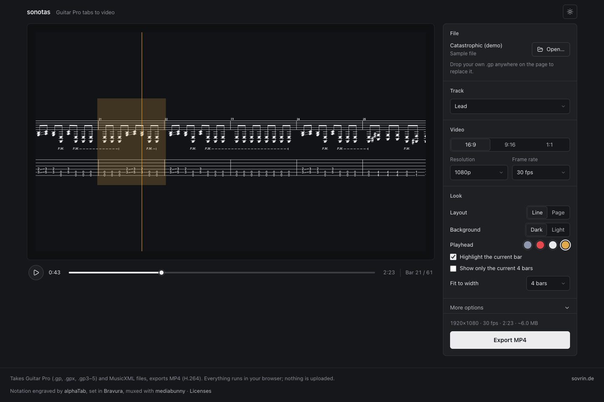

# sonotas

**Turn Guitar Pro tabs into scrolling play-along videos, right in your browser.**

Drop in a `.gp` file, pick a track, tweak the look, and export an MP4 with a moving
playhead, ready for YouTube, Shorts, Reels or TikTok. Rendering and encoding run
entirely on your machine, so nothing gets uploaded.

<picture>
  <source media="(prefers-color-scheme: light)" srcset="docs/screenshot-light.png">
  
</picture>

## Features

- **Guitar Pro and MusicXML in:** `.gp`, `.gpx`, `.gp3`–`.gp5` and MusicXML.
  Multi-track files let you choose which track to render.
- **MP4 out:** H.264 encoded through WebCodecs at 480p, 720p or 1080p and
  24, 30 or 60 fps, with an up-front file size estimate. The clip is split
  across several encoders at once; *Fast export* switches to software encoders
  on half your CPU cores for roughly 3× faster exports and larger files.
- **Any aspect ratio:** 16:9 for YouTube, 9:16 for Shorts, Reels and TikTok, 1:1 for square posts.
- **Two layouts:** a single *line* that scrolls (bar snap, bar pan, continuous or
  centered), or a *page* of wrapped systems that the view follows down.
- **Fit to width:** size the notation so 1–8 bars span the frame, optionally
  showing only the current bars.
- **Styling:** tab only, standard notation or both. Dark or light canvas, custom
  colours for background, notation and bar numbers. Playhead colour, width,
  height and offset. Bar highlight and current-note recolouring.
- **Extras:** export a range of bars, change the playback speed from 0.25× to 2×, and
  toggle the song title, track name, tempo marking, bar numbers and chord diagrams.
- **Live preview:** scrub and play the exact frames that end up in the video.

## Built on alphaTab

Everything musical in sonotas is done by [alphaTab](https://www.alphatab.net),
the open-source notation engine by [Daniel Kuschny and contributors](https://github.com/CoderLine/alphaTab).
It reads every supported Guitar Pro format and MusicXML, engraves the tablature
and standard notation you see in the video, and supplies the MIDI timing that
moves the playhead. sonotas adds the camera, the styling and the encoder around
it. alphaTab is licensed under the MPL-2.0; if it is useful to you, star the
repo or [contribute](https://github.com/CoderLine/alphaTab/blob/develop/CONTRIBUTING.md).
Exports carry alphaTab's own "rendered by alphaTab" line unless you turn it off
under *More options*.

## How it works

The app is a [Nuxt](https://nuxt.com) + [Nuxt UI](https://ui.nuxt.com) front end
over a small, browser-only renderer package:

```
app/                  Nuxt UI: preview stage, transport, settings and export panels
packages/renderer/    Guitar Pro → video engine
  score.ts            load and engrave the tab with alphaTab
  timeline.ts         map playback time to bars and beats (tempo changes, repeats)
  scroll.ts           camera movement for each scroll mode
  paint.ts            composite each frame: sheet, highlight, playhead, overlays
  encode.ts           encode frames on parallel WebCodecs encoders, mux to MP4 with mediabunny
public/tabs/          sample tabs (the demo loads Catastrophic.gp)
```

Notation is engraved by [alphaTab](https://www.alphatab.net) using a subset of the
[Bravura](https://github.com/steinbergmedia/bravura) music font. Video is encoded
through WebCodecs and muxed with [mediabunny](https://mediabunny.dev).

> [!NOTE]
> Export uses the browser's WebCodecs H.264 encoder. Recent Chrome and Edge
> builds work best.

## Getting started

You need Node 22+ and pnpm (`corepack enable` sets up the pinned version).

```bash
pnpm install
pnpm dev          # http://localhost:3000
```

Other scripts:

| Command                       | What it does                                    |
| ----------------------------- | ----------------------------------------------- |
| `pnpm lint`                   | ESLint across the workspace                     |
| `pnpm typecheck`              | Type-check the Nuxt app                         |
| `pnpm generate`               | Prerender the static site into `.output/public` |
| `pnpm preview`                | Serve the production build locally              |
| `pnpm --filter renderer test` | Run the renderer unit tests                     |

## Self-hosting with Docker

The production image prerenders the app and serves the static files with
[static-web-server](https://static-web-server.net). There is no Node at runtime.

```bash
docker compose up -d --build   # http://localhost:3000
```

### Rebuilding the music font

`public/fonts/sonotas-music.woff2` is a subset of Bravura holding only the
glyphs alphaTab can emit. Bravura's license reserves its name for the original,
so the subset is renamed to "Sonotas Music" on the way. To regenerate it after
an alphaTab upgrade, with all tooling pinned inside Docker, run:

```bash
docker build --target font --output public/fonts .
```

Natively, with `harfbuzz` and `woff2` installed (`brew install harfbuzz woff2`),
`pnpm build-font` produces the same subset but skips the rename unless
fontTools' `ttx` is on your PATH. Use the Docker route for the committed file.

## License

sonotas is [MIT](LICENSE) licensed. It ships alphaTab (MPL-2.0), the Bravura
font (SIL OFL 1.1), mediabunny (MPL-2.0) and Nuxt UI (MIT); their notices are
collected in [THIRD_PARTY_NOTICES.md](THIRD_PARTY_NOTICES.md).
